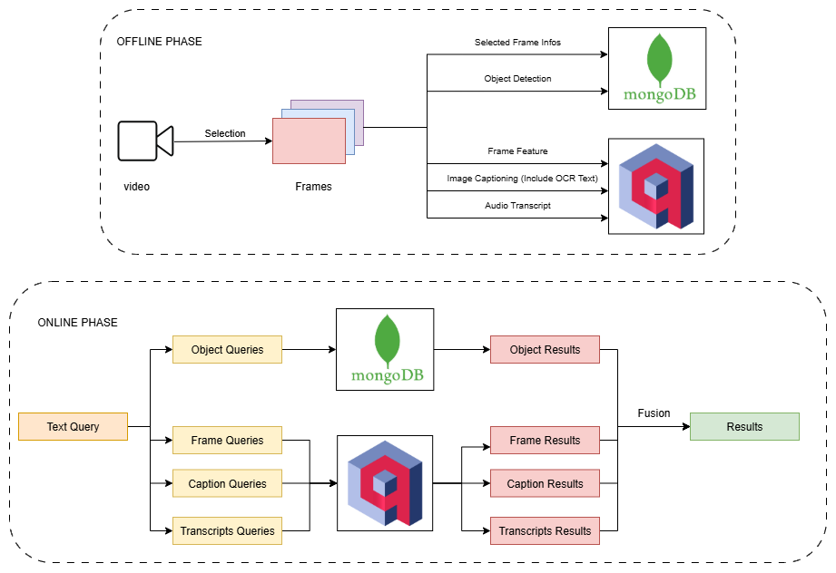

# Video Frame Retrieval System

## Overview
The Video Frame Retrieval system enables querying and searching for video frames based on multiple types of information: objects in the image, visual features, content descriptions (captions & OCR text), and audio transcripts.

The pipeline is divided into two main phases:

- **Offline Phase**: Preprocess video data, extract relevant information, and store it in databases.

- **Online Phase**: Process text queries and return the most relevant results.

The system uses **ReactJS** for the frontend interface and **FastAPI** as the backend API service.
---

## System Architecture

### 1. Offline Phase (Video Preprocessing)  
**Objective**: Extract information from videos and store it in databases to accelerate query performance.

1. **Video Input**  
   - Receive the input video.  
   - Select representative frames based on a selection strategy (e.g., time-based sampling, scene change detection).

2. **Processing Steps**  
   - **Selected Frame Infos** → Store in **MongoDB**.  
   - **Object Detection** → Identify objects and bounding boxes, store results in MongoDB.  
   - **Frame Feature Extraction** → Extract visual features and store in a **vector database** (e.g., Qdrant).  
   - **Image Captioning (Including OCR)** → Generate image captions and OCR text, store in the vector database.  
   - **Audio Transcript** → Convert speech to text and store in the vector database.

3. **Databases**  
   - **MongoDB**: Stores object information and frame metadata.  
   - **Vector Database Qdrant**: Stores vector embeddings for image features, captions, and transcripts.

---

### 2. Online Phase (Query & Retrieval)  
**Objective**: Process text queries and return the most relevant video frames.

1. **Text Query**  
   - The user inputs a text query.

2. **Query Processing**  
   - **Object Queries** → Search for objects in MongoDB.  
   - **Frame Queries** → Match frame feature vectors in the vector database.  
   - **Caption Queries** → Match caption embeddings.  
   - **Transcript Queries** → Match transcript embeddings.

3. **Result Fusion**  
   - Combine (fuse) results from multiple search sources.  
   - Return the final ranked list of results to the user.

---

## Technology Stack
- **Databases**:  
  - MongoDB → Stores metadata and object detection results.  
  - Vector Database Qdrant → Stores embeddings for frames, captions, and transcripts.
- **AI Models**:  
  - Object Detection: [YOLOv12](https://docs.ultralytics.com/vi/models/yolo12/).  
  - Feature Extraction: [CLIP-L-14](https://huggingface.co/apple/DFN2B-CLIP-ViT-L-14)
  - Image Captioning (including OCR text): [VinternVL](https://huggingface.co/5CD-AI/Vintern-1B-v3_5)
  - Speech-to-Text: [Whisper](https://huggingface.co/openai/whisper-large-v3).
  - Text Embedding: [BGE](https://huggingface.co/AITeamVN/Vietnamese_Reranker)
  - Translator: [EnViT5](https://huggingface.co/VietAI/envit5-translation)
- **Backend**:  
  - FastAPI / Flask for query API services.  
- **Frontend**:  
  - ReactJS (or similar) for the search interface.

---

## Workflow Summary
1. **Offline**: Video → Frames → Extract objects, features, captions, transcripts → Store in DB.  
2. **Online**: Text Query → Multi-source search → Fusion → Results.

---

## Advantages
- **Multi-modal search**: Combines information from visual content, OCR text, transcripts, and object detection.  
- **Fast retrieval** thanks to preprocessed and pre-stored embeddings.  
- **Scalability**: Easy to add new data sources or AI models.